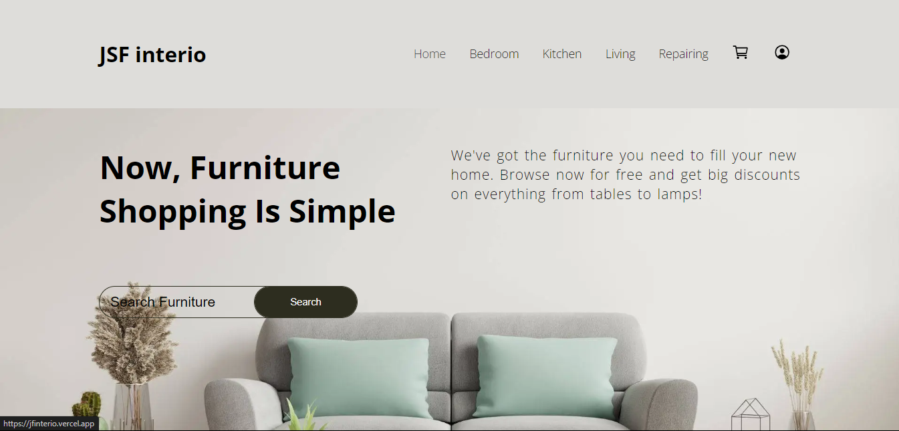
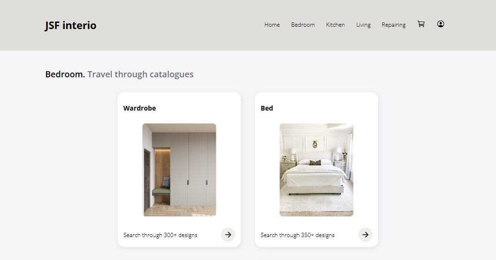

# JF interio

A simplified and convenient way of purchasing furniture.

## Who are we?

We are serving people in the Kolkata and beyond since last 60 years. During these years, we pioneered the art of manufacturing furniture in the both wooden and plywood artifacts. We are guided by our principle,

> "Truth will be victorious eternally"

## Why us?

- We are a team of highly skilled engineers, love to dedicate ourselves crafting convenience and glorious.
- We make our products with a 'mm' level of accuracy.
- Furnished by us are guaranteed to last centuries.

## [Our platform](https://jfinterio.vercel.app) 

**_our home page_**

### Considerations

- We wanted to make our web presence refreshing, enjoying and user experience like never before.
- Home designed keeping simplicity and efficiency.
- Search through a overwhelming 5000+ furniture designs.
- Custom design feature to let you build your own in furniture with size, color and variant.
- Augmented Reality let you put your furniture in real world.

### How you explore?

We have kept the catalogs well organized into its specific spaces. That helps in finding your need quick. Let's see how...

1. Go the space, lets say "Bedroom".
2. Select the category, lets say "Bed".
3. Choose type in above selected category, lets say "Double Bed".
4. Explore a large volume of designs on the type as per size and variant.

   
   ***view of Bedroom space***
### You researches are safe
Our platform with "Cart" and "Profile" is there to help you out in saving your previous visit. Research relentlessly and store product for future comings. 

## Having issues?
- Reach out to us on this [this](jayprakashsharma225@gmail.com) email address.
- Create issue on this repo. Make sure a similar issue doesn't exists.
- Contact us if you are one who want more out of our platform. We love to hear your ideas.